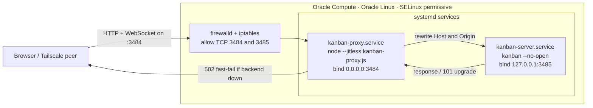
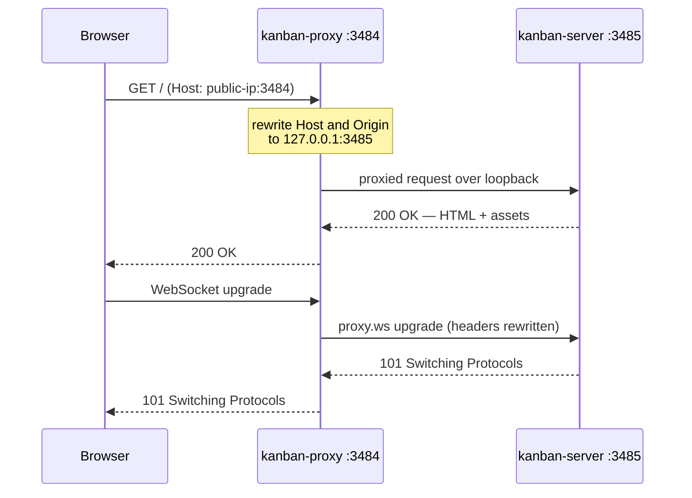

# Architecture

Runtime architecture of the **Cline Kanban** board as deployed to an Oracle Cloud (OCI)
compute instance. For the deployment pipeline see [`WORKFLOW.md`](WORKFLOW.md); for a fuller
narrative (with runbook and troubleshooting) see the Confluence page
**cline-kanban-executables — Repository Guide**
(<https://modrev.atlassian.net/wiki/spaces/PM/pages/360450>).

## Diagram source (Lucid)

The canonical, editable architecture diagram is maintained in Lucidchart:

- **View:** <https://lucid.app/lucidchart/253bdc36-2e3b-4012-9519-9f91ee7fcc22/view>
- **Edit:** <https://lucid.app/lucidchart/253bdc36-2e3b-4012-9519-9f91ee7fcc22/edit>

The Mermaid diagrams below mirror it and render inline on GitHub; keep them in sync with the
Lucid source when the topology changes.

## System architecture

Why the proxy exists: Cline's Kanban server enforces a `Host`/`Origin` check and binds to
loopback only (`127.0.0.1:3485`). Exposing that port directly would reject remote browsers,
whose `Host` header carries the instance's public IP. **kanban-proxy** listens on
`0.0.0.0:3484` and rewrites the `Host` and `Origin` headers (on both HTTP requests and
WebSocket upgrades) to what the backend expects before forwarding to the loopback port. Only
`3484` is ever exposed publicly. On Oracle Linux the proxy's loopback `connect()` is denied by
SELinux (`EACCES` → `502`), so the deploy sets SELinux permissive on this single-user box.

## Request lifecycle

## Services & ports

| Component | Unit / command | Bind | Exposure |
|---|---|---|---|
| kanban-proxy | `kanban-proxy.service` → `node --jitless kanban-proxy.js` | `0.0.0.0:3484` | Public (`PROXY_PORT`) |
| kanban-server | `kanban-server.service` → `kanban --no-open` | `127.0.0.1:3485` | Loopback (`KANBAN_RUNTIME_HOST`/`KANBAN_RUNTIME_PORT`) |

> **Reachability:** if `:3484` is unreachable after a successful deploy, the OCI **VCN Security
> List / NSG** is almost certainly missing an ingress rule for **TCP 3484** (Source
> `0.0.0.0/0`) — a cloud-console setting the workflow cannot change from inside the instance.
