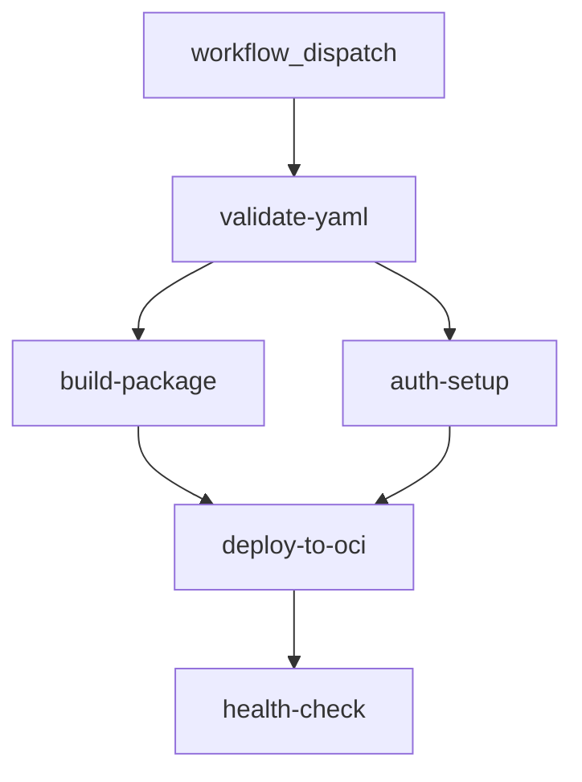

# GitHub Actions CI/CD Pipeline Documentation

## Oracle Compute Deployment Pipeline

This document describes the modular GitHub Actions CI/CD pipeline for deploying the Cline Kanban application to Oracle Cloud Infrastructure (OCI) Compute instances.

---

## 🏗️ Architecture Overview

The pipeline follows a **modular, reusable workflow** pattern using GitHub Actions `workflow_call` triggers. This design provides:

- **Separation of Concerns**: Each workflow has a single responsibility
- **Reusability**: Workflows can be called independently or as part of the main pipeline
- **Maintainability**: Changes to one stage don't affect others
- **Parallel Execution**: Independent jobs run concurrently where possible
- **Clear Dependencies**: Explicit `needs` relationships define execution order

### Execution Sequence



| Stage | Workflow | Trigger | Runs On | Duration |
|-------|----------|---------|---------|----------|
| 1 | **Validate YAML** | `workflow_call` + push/PR | `ubuntu-latest` | ~10s |
| 2 | **Build & Package** | `workflow_call` | `windows-latest` | ~30s |
| 3 | **Auth & Environment Setup** | `workflow_call` | `windows-latest` | ~30s |
| 4 | **Deploy to OCI** | `workflow_call` | `windows-latest` | ~5-10 min |
| 5 | **Health Check** | `workflow_call` | `windows-latest` | ~2 min |

---

## 📁 Workflow Files Structure

```
.github/workflows/
├── deploy-oracle.yml          # Main orchestration workflow
├── validate-yaml.yml          # YAML syntax validation
├── build-package.yml          # Build and package artifacts
├── auth-setup.yml             # SSH auth & environment prep
├── deploy-to-oci.yml          # Deploy to Oracle Compute
├── health-check.yml           # Post-deployment verification
└── test-dispatch.yml          # Test workflow (development)
```

---

## 🔐 Required GitHub Secrets

Configure these secrets in **Repository Settings → Secrets and variables → Actions**:

| Secret | Description | Required | Example |
|--------|-------------|----------|---------|
| `ORACLE_HOST` | Oracle Compute instance public IP or hostname | ✅ | `129.146.xxx.xxx` |
| `ORACLE_USER` | SSH username (typically `opc` for Oracle Linux) | ✅ | `opc` |
| `ORACLE_SSH_KEY_B64` | Base64-encoded SSH private key | ✅ | `LS0tLS1CRUdJTi...` |
| `DEPLOY_PATH` | Remote deployment directory path | ✅ | `/home/opc/kanban` |
| `GH_PAT` | GitHub Personal Access Token (for private repo access) | ⚠️ Optional | `ghp_xxxxxxxxxxxx` |

### Generating `ORACLE_SSH_KEY_B64`

```bash
# On Linux/macOS:
base64 -i ~/.ssh/oracle_key | tr -d '\n'

# On Windows PowerShell:
[Convert]::ToBase64String([IO.File]::ReadAllBytes("$env:USERPROFILE\.ssh\oracle_key")) -replace '[\r\n]', ''
```

---

## 📋 Workflow Details

### 1. Main Orchestration: `deploy-oracle.yml`

**Trigger**: `workflow_dispatch` (manual)

**Inputs**:
| Input | Type | Required | Default | Description |
|-------|------|----------|---------|-------------|
| `environment` | choice | ✅ | `production` | Deployment environment |
| `force` | boolean | ❌ | `false` | Force deployment even if no changes |

**Jobs** (all use `workflow_call`):
- `validate-yaml` → calls `validate-yaml.yml`
- `build-package` → calls `build-package.yml` (needs: validate-yaml)
- `auth-setup` → calls `auth-setup.yml` (needs: validate-yaml)
- `deploy-to-oci` → calls `deploy-to-oci.yml` (needs: build-package, auth-setup)
- `health-check` → calls `health-check.yml` (needs: deploy-to-oci)

**Secrets**: Inherited and passed explicitly to child workflows

---

### 2. Validate YAML: `validate-yaml.yml`

**Triggers**:
- `workflow_call` (from main workflow)
- `push` / `pull_request` (paths: `*.yml`, `*.yaml`, `.github/workflows/**`)

**Purpose**: Validates all YAML files in the repository for syntax correctness

**Job**: `validate-yaml` (runs on `ubuntu-latest`)

**Steps**:
1. Checkout repository
2. Set up Python 3.x
3. Install PyYAML
4. Find all YAML files (excluding `.git`)
5. Validate each file with `yaml.safe_load()`

**Outputs**: None (fail-fast on invalid YAML)

---

### 3. Build & Package: `build-package.yml`

**Trigger**: `workflow_call`

**Inputs**:
| Input | Type | Required | Default | Description |
|-------|------|----------|---------|-------------|
| `environment` | string | ✅ | - | Deployment environment |
| `force` | boolean | ❌ | `false` | Force rebuild |

**Outputs**:
| Output | Description |
|--------|-------------|
| `artifact-path` | Local path to staged artifacts |
| `deploy-files` | JSON array of files to deploy |

**Job**: `build` (runs on `windows-latest`)

**Steps**:
1. Checkout repository
2. Verify source files exist:
   - `prod_executable/cline-remote-launch.ps1`
   - `prod_executable/cline-remote-launch.sh`
   - `prod_executable/kanban-proxy.js`
   - `start-all.bat`, `start-all.ps1`
   - `start-all-with-tailscale.bat`, `start-all-with-tailscale.ps1`
   - `README.md`
3. Package artifacts into `deploy-staging/`:
   - Copy `prod_executable/` → `deploy-staging/prod_executable/`
   - Copy start scripts → `deploy-staging/`
   - Copy `README.md` → `deploy-staging/`
4. Upload as artifact `deployment-artifacts` (1-day retention)

---

### 4. Auth & Environment Setup: `auth-setup.yml`

**Trigger**: `workflow_call`

**Inputs**:
| Input | Type | Required | Description |
|-------|------|----------|-------------|
| `environment` | string | ✅ | Deployment environment |

**Secrets** (required):
- `ORACLE_HOST`, `ORACLE_USER`, `ORACLE_SSH_KEY_B64`, `DEPLOY_PATH`

**Outputs**:
| Output | Description |
|--------|-------------|
| `ssh-key-path` | Path to SSH key on runner (`~/.ssh/oracle_key`) |
| `known-hosts-path` | Path to known_hosts file (`~/.ssh/known_hosts`) |

**Job**: `auth` (runs on `windows-latest`)

**Steps**:
1. **Setup SSH Key**:
   - Decode base64 SSH key (with whitespace cleaning)
   - Write to `~/.ssh/oracle_key`
   - Set read-only permissions via `icacls`
   - Run `ssh-keyscan` to populate `known_hosts`
2. **Test SSH Connection**: Verify connectivity to Oracle instance
3. **Create Deploy Directory**: `mkdir -p $DEPLOY_PATH/prod_executable` on Oracle

---

### 5. Deploy to OCI: `deploy-to-oci.yml`

**Trigger**: `workflow_call`

**Inputs**:
| Input | Type | Required | Default | Description |
|-------|------|----------|---------|-------------|
| `environment` | string | ✅ | - | Deployment environment |
| `ssh-key-path` | string | ✅ | - | From auth-setup output |
| `known-hosts-path` | string | ✅ | - | From auth-setup output |
| `artifact-name` | string | ❌ | `deployment-artifacts` | Artifact to download |

**Secrets** (required):
- `ORACLE_HOST`, `ORACLE_USER`, `DEPLOY_PATH`
- `GH_PAT` (optional, for private repo access)

**Job**: `deploy` (runs on `windows-latest`, timeout: 30 min)

**Steps**:
1. **Download Artifacts**: Download `deployment-artifacts` to `deploy-staging/`
2. **Deploy prod_executable Files**: SCP files, `chmod +x` shell scripts
3. **Deploy Start Scripts**: SCP `.bat` and `.ps1` files
4. **Deploy README**: SCP `README.md`
5. **Install Node.js & Dependencies on Oracle**:
   - Add 4GB swap file (prevents OOM on free tier)
   - Install Node.js 22.14.0 via binary tarball (low memory)
   - Install git, configure npm for low memory
   - Install `http-proxy` globally
   - Install latest `cline` from `modrev-ai/cline` releases
6. **Create & Deploy systemd Services**:
   - `kanban-proxy.service` (port 3484, header rewriting proxy)
   - `kanban-server.service` (port 3485, Kanban app via `cline kanban`)
   - Deploy via SCP, move to `/etc/systemd/system/`, `daemon-reload`
7. **Configure Firewall**: Open ports 3484/3485 (firewalld + iptables fallback)
8. **Enable & Start Services**: `systemctl enable/start` both services
9. **Wait for Services**: 10s delay, then show status

---

### 6. Health Check: `health-check.yml`

**Trigger**: `workflow_call`

**Inputs**:
| Input | Type | Required | Description |
|-------|------|----------|-------------|
| `environment` | string | ✅ | Deployment environment |
| `ssh-key-path` | string | ✅ | From auth-setup output |
| `known-hosts-path` | string | ✅ | From auth-setup output |

**Secrets** (required):
- `ORACLE_HOST`, `ORACLE_USER`, `DEPLOY_PATH`

**Job**: `health-check` (runs on `windows-latest`, timeout: 15 min)

**Steps**:
1. **Check Service Status**: `systemctl status` for both services, port bindings, Tailscale
2. **Verify Local Connectivity**: Test `curl` to localhost:3484 and localhost:3485
3. **HTTP Health Checks** (from runner):
   - Retry up to 5× (10s delay) for HTTP 200 on both ports
   - Test `http://ORACLE_HOST:3484` (proxy) and `http://ORACLE_HOST:3485` (server)
4. **Deployment Summary**: Write markdown summary to `$GITHUB_STEP_SUMMARY` with:
   - Environment, host, deploy path, timestamp
   - Services deployed
   - Access URLs (Tailscale IP if available, otherwise direct IP)

---

## 🚀 Usage

### Manual Deployment

1. Go to **Actions → Deploy to Oracle Compute**
2. Click **Run workflow**
3. Select environment (`production`)
4. Optionally enable **Force deployment**
5. Click **Run workflow**

### Automatic Validation

YAML validation runs automatically on:
- Push to any branch (YAML file changes)
- Pull requests (YAML file changes)

---

## 🔧 Troubleshooting

### Common Issues

| Issue | Cause | Resolution |
|-------|-------|------------|
| SSH key decode fails | Whitespace/newlines in secret | Ensure secret is single-line base64 |
| SSH connection timeout | Security list / firewall | Check OCI security lists allow port 22 |
| Node.js install OOM | Free tier memory limit | 4GB swap file is created automatically |
| systemd service not found | Line endings / path issues | Scripts use Unix line endings via `UTF8NoBOM` |
| Port not accessible | Firewall | Health check verifies firewalld/iptables |

### Debugging Tips

1. **Check workflow logs**: Each step outputs detailed information
2. **SSH manually**: Use the same key to debug on the instance
3. **Check systemd logs**: `journalctl -u kanban-proxy -f`
4. **Verify ports**: `ss -tlnp | grep -E "3484|3485"`

---

## 📝 Maintenance

### Updating Node.js Version

Edit `deploy-to-oci.yml` → `NODE_VERSION` variable (line ~96)

### Updating Cline Version

Automatic - fetches latest release from `modrev-ai/cline` via GitHub API

### Adding New Files to Deploy

Edit `build-package.yml` → verification list (lines 37-46) and copy steps (lines 74-81)

### Modifying Service Configuration

Edit `deploy-to-oci.yml` → service file creation steps (lines 146-196)

---

## 📚 Related Documentation

- `ORACLE_DEPLOYMENT.md` - Initial deployment guide
- `ORACLE_DEPLOYMENT_COMPLETE.md` - Complete deployment notes
- `YAML_VALIDATION.md` - YAML validation details
- `server_init/GITHUB_SERVER_SETUP.md` - Server setup instructions

---

## 🏷️ Version History

| Date | Version | Changes |
|------|---------|---------|
| 2026-08-04 | 1.0.0 | Initial modular pipeline documentation |

---

*Generated from `.github/workflows/` - Keep this document in sync with workflow changes.*